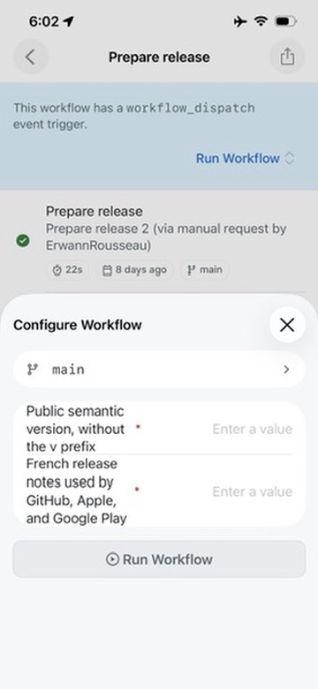
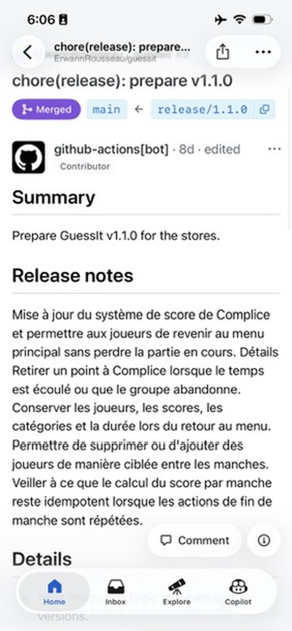
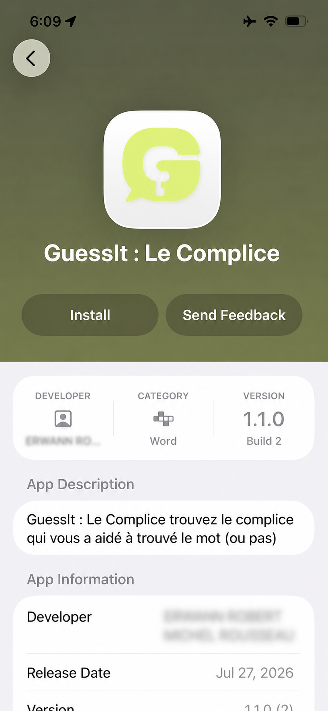
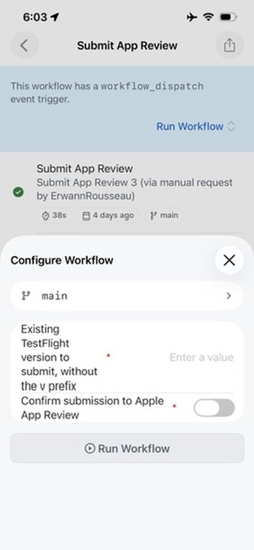

# Automatiser mes releases React Native depuis mon iPhone

Je développais une petite application React Native pour le fun, souvent depuis mon iPhone. Avec Codex dans l’appli ChatGPT, je pouvais piloter mon agent sur mon Mac et faire avancer le projet sans rester assis devant mon bureau.

Puis arrivait la release. Et là, retour à l’ancien workflow Fastlane : lancer le build en local, garder un œil dessus et attendre que tout parte correctement vers TestFlight. Fastlane faisait le travail, mais sans CI ni infrastructure autour, mon Mac restait le centre des opérations.

Pour une app personnelle, je n’avais aucune envie de monter une petite usine à releases. Je voulais quelque chose de simple, peu coûteux et surtout cohérent avec ma façon de développer.

La contrainte est devenue assez évidente : **si je peux développer depuis mon téléphone, je dois aussi pouvoir livrer depuis mon téléphone.** Et via une seule application : GitHub.

Le résultat tient en une ligne :

`Préparer → review → merge → tag → build EAS → TestFlight → tester → soumettre à App Review`

Il reste deux décisions humaines dans ce parcours. La première lance la release avec sa version et son changelog. La seconde autorise la soumission du build testé à App Review. Entre les deux, les workflows bossent tout seuls. Il faut bien que le YAML serve à quelque chose.

## Premier feu vert : préparer ce qui va partir

Depuis l’appli GitHub, j’ouvre le workflow de préparation. Je saisis une version sémantique, les notes de release en français, puis je le lance. À ce stade, mon travail tient dans ces deux champs.

```yaml
on:
  workflow_dispatch:
    inputs:
      version:
        description: Public semantic version, without the v prefix
        required: true
        type: string
      release_notes:
        description: French release notes
        required: true
        type: string
```

`workflow_dispatch` crée directement le formulaire dans l’appli GitHub. Pas besoin de développer une interface dédiée pour envoyer deux valeurs à un pipeline.



_Le workflow de préparation se lance directement depuis l’appli GitHub._

Avant de toucher aux fichiers, le workflow vérifie que la release part de `main`, que la version est valide et que le champ « What’s New » n’est pas vide. Il aligne ensuite la version de l’application, du package et des métadonnées Apple.

Il lance les mêmes contrôles que pour n’importe quelle contribution : formatage, lint, vérification des types et tests. Si tout passe, il crée une branche `release/X.Y.Z`, commit les changes puis ouvre une PR.

```yaml
- name: Validate prepared release
  run: |
    bun run format:check
    bun run lint
    bun run typecheck
    bun run test

- name: Commit release branch
  run: |
    git switch -c "$RELEASE_BRANCH"
    git add app.config.ts package.json store-metadata
    git commit -m "chore(release): prepare v$RELEASE_VERSION"
    git push --set-upstream origin "$RELEASE_BRANCH"

- name: Open release pull request
  run: |
    gh pr create \
      --base main \
      --head "$RELEASE_BRANCH" \
      --title "chore(release): prepare v$RELEASE_VERSION" \
      --body-file "$PR_BODY"
```

`PR_BODY` contient le résumé et les release notes préparés juste avant. Rien de magique ici : la release devient une branche, un commit et une PR. Bref, exactement le genre de chose que GitHub sait déjà très bien afficher.

Depuis mon téléphone, je peux relire le changelog et vérifier une dernière fois les changes avant de merge. La release est clairement visible et peut être review, plutôt que préparée par une suite de commandes lancées hors de GitHub.



_La release PR regroupe la version, la branche et les notes à review avant de merge._

## Le tag vient après la review, pas avant

J’aurais pu créer le tag dès le premier workflow. C’était plus court, mais ça retirait la garantie qui m’intéressait vraiment : construire le code que je viens de relire et de merge.

Un second workflow attend donc la fermeture de la PR et ne continue que si elle a bien été merge. Il récupère son `merge_commit_sha`, puis crée le tag annoté dessus.

```yaml
if: >-
  github.event.pull_request.merged == true &&
  startsWith(github.event.pull_request.head.ref, 'release/')

env:
  RELEASE_COMMIT: ${{ github.event.pull_request.merge_commit_sha }}

- name: Create the annotated tag
  run: |
    git tag -a "$TAG" "$RELEASE_COMMIT" -m "$TAG"
    git push origin "$TAG"
```

Le tag répond à une question très concrète : quel code a produit ce build ? Si quelque chose coince plus tard, je retrouve immédiatement le commit utilisé.

Le même workflow crée ensuite la GitHub Release. EAS détecte le tag `vX.Y.Z` et démarre le build iOS de production. Je peux alors suivre la même release depuis la PR jusqu’au binaire envoyé sur TestFlight.

## EAS sort le build de mon Mac

EAS est le service cloud d’Expo pour construire et distribuer des applications. Dans mon cas, son rôle est simple : GitHub pousse le tag, EAS le détecte et lance le build sur une machine distante. Mon Mac peut aller faire autre chose.

La configuration tient en deux jobs. Le premier construit l’application avec le profil iOS de production. Le second attend le résultat, récupère son identifiant et envoie ce même build vers TestFlight.

```yaml
on:
  push:
    tags:
      - "v*.*.*"

jobs:
  build_ios:
    type: build
    params:
      platform: ios
      profile: production

  testflight:
    needs: [build_ios]
    type: submit
    params:
      build_id: ${{ needs.build_ios.outputs.build_id }}
      profile: production
```

Le passage du `build_id` est important : le build produit par le premier job est bien celui envoyé à TestFlight. On ne cherche pas « le dernier build » en espérant tomber sur le bon.

## TestFlight n’arrête pas l’automatisation

Une fois le binaire dans TestFlight, la release est préparée. Je peux l’installer sur mon iPhone et la partager avec d’autres personnes, pas seulement des devs. Elles installent l’app normalement, la testent et me donnent leur ressenti.



_Le même build est disponible dans TestFlight pour la vérification sur un vrai appareil._

Ça permet de vérifier ce qu’aucun test automatisé ne mesure vraiment : le feeling de l’application, ses transitions et son comportement sur un vrai appareil.

Ce test manuel ne marque pas la fin de l’automatisation. Le pipeline attend juste mon deuxième feu vert, comme il attendait au départ la version et les notes de release.

Quand le build me convient, j’ouvre un second workflow dans GitHub. Je renseigne la version et je confirme la soumission. ASC CLI prend ensuite le relais pour piloter App Store Connect : il valide les métadonnées, sélectionne le dernier build TestFlight valide pour cette version, simule la soumission, puis l’envoie à App Review.

```yaml
on:
  workflow_dispatch:
    inputs:
      version:
        required: true
        type: string
      confirm_submission:
        required: true
        default: false
        type: boolean

jobs:
  submit:
    if: inputs.confirm_submission
```

Le booléen n’est pas là pour décorer le formulaire. Sans confirmation, le job ne démarre pas.



_Après les tests, la soumission à App Review demande une confirmation explicite._

```yaml
- name: Resolve latest valid build
  id: build
  run: |
    BUILD_ID="$(
      asc builds list \
        --app "$ASC_APP_ID" \
        --version "$RELEASE_VERSION" \
        --platform IOS \
        --processing-state VALID \
        --sort=-uploadedDate \
        --limit 1 \
        --output json |
        jq -er '.data[0].id'
    )"
    echo "id=$BUILD_ID" >>"$GITHUB_OUTPUT"

- name: Preview App Review submission
  env:
    BUILD_ID: ${{ steps.build.outputs.id }}
  run: |
    asc review submit \
      --app "$ASC_APP_ID" \
      --version "$RELEASE_VERSION" \
      --build "$BUILD_ID" \
      --platform IOS \
      --dry-run \
      --output table

- name: Submit App Review
  env:
    BUILD_ID: ${{ steps.build.outputs.id }}
  run: |
    asc review submit \
      --app "$ASC_APP_ID" \
      --version "$RELEASE_VERSION" \
      --build "$BUILD_ID" \
      --platform IOS \
      --confirm \
      --output table
```

Le workflow prend le dernier build valide de la version demandée. Il lance d’abord la commande avec `--dry-run`, puis exécute la même soumission avec `--confirm`. Je choisis le moment. ASC CLI s’occupe du reste.

Je n’ai donc pas supprimé l’humain du pipeline. Je limite juste son rôle et le temps qu’il y passe : annoncer la release, tester le résultat et autoriser sa soumission. Tout le reste se fait tout seul.

`Intention humaine → préparation automatisée → test humain → soumission automatisée`

## Ce que je garderais sur une autre app

Mon implémentation couvre aujourd’hui iOS, TestFlight et App Review. Android et Google Play restent à ajouter, mais le modèle ne dépend pas vraiment d’Apple.

Les principes que je conserverais :

- **Préparer dans GitHub.** La version, les notes et les métadonnées sont relues avant la création du tag.
- **Taguer le commit réellement validé.** En cas de problème, le tag permet de retrouver immédiatement le code qui a produit le build.
- **Un seul outil pour chaque opération.** EAS construit et envoie le binaire. Côté Apple, ASC CLI gère les métadonnées et la soumission à App Review.
- **Faire des décisions humaines de vraies étapes du système.** Je donne le feu vert ; le workflow exécute la suite.

Je l’utilise seul, mais ce modèle devient encore plus intéressant en équipe. GitHub garde ce qui va partir, les validations effectuées et les décisions prises. La release n’existe plus seulement dans un terminal ou dans la mémoire de la personne qui la prépare.

Il reste une limite assumée : ce parcours couvre les releases depuis `main`. Pour faire tester une branche avant de merge, je dois encore lancer les commandes depuis un Mac. Un workflow de preview dédié pourra compléter le système si le besoin devient régulier.

Et voilà. Depuis mon iPhone, je peux donner une version et un changelog, review la préparation, tester le build puis autoriser son départ vers App Review. Pas besoin de sortir un terminal de ma poche.

Je peux terminer depuis mon téléphone le parcours que j’y ai commencé : développer une idée, préparer sa release, la tester, puis l’envoyer vers l’App Store. Et franchement, la DX est plutôt sympa.
